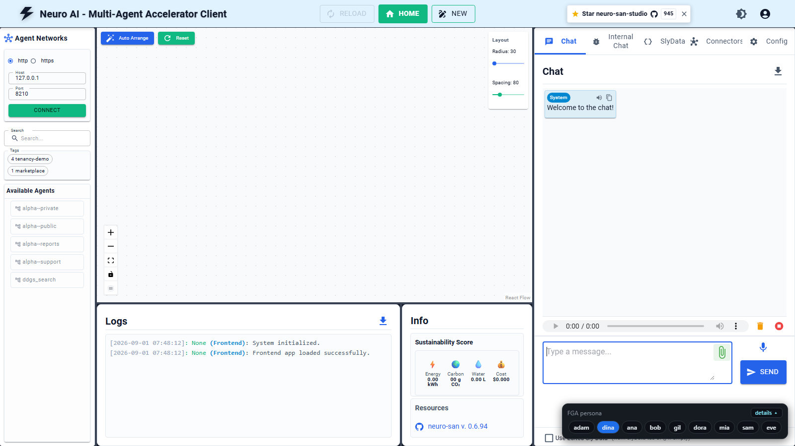
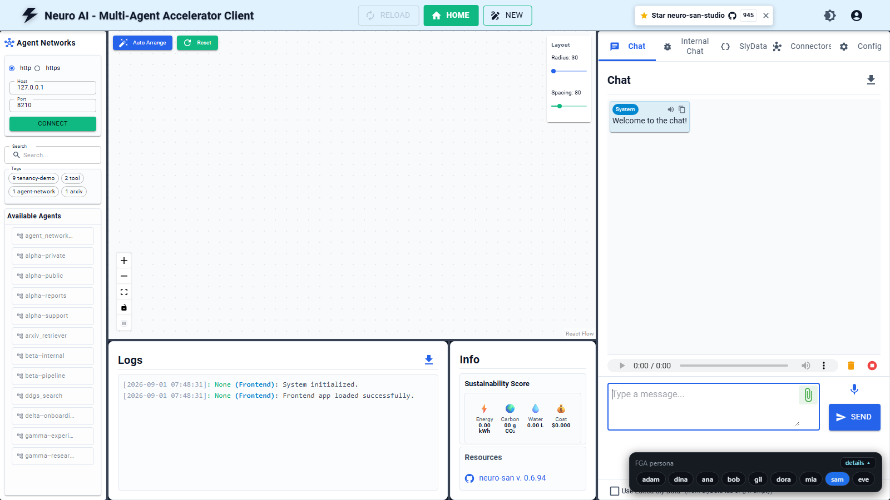
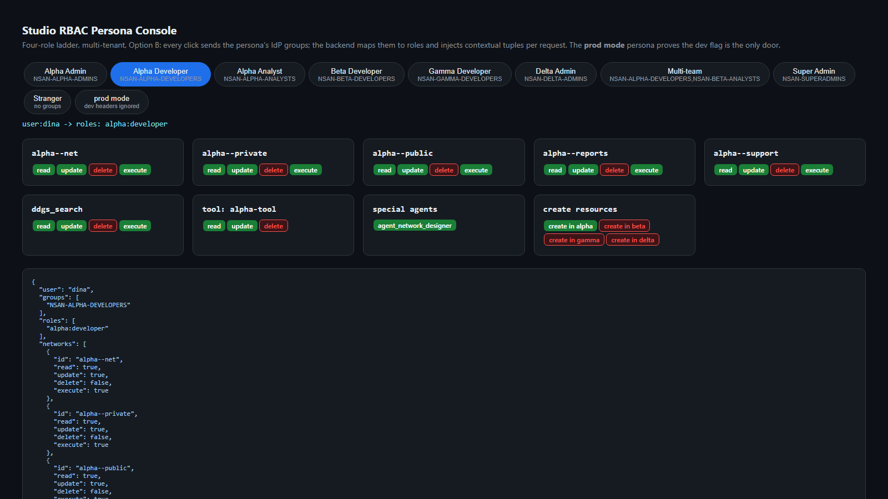

# Enterprise Vibe FGA

Fine-grained, multi-tenant authorization for vibe-to-production agent platforms.

This repo takes the [neuro-san](https://github.com/cognizant-ai-lab/neuro-san) agent runtime
(via a snapshot of [neuro-san-studio](https://github.com/cognizant-ai-lab/neuro-san-studio))
and adds an enterprise authorization layer on [OpenFGA](https://openfga.dev), the
Zanzibar-descended relationship-based access control engine. The result: teams operate as
isolated tenants on one shared cluster, publish agent networks and connectors to a
marketplace with a single tuple write, and LLM usage and bring-your-own-model rights are
governed as super-admin-controlled entitlements.

Everything here is verified end to end: model-layer tests run against the FGA CLI's built-in
engine, and a live E2E suite runs a real OpenFGA server plus a real neuro-san server and
asserts allow/deny per persona over HTTP.

## The objective

Picture an enterprise agent platform: one shared cluster, ~100 teams, 500+ employees.
Teams build agent networks and connectors that must stay **private to their team by
default**, yet any team can **publish** its work to a marketplace for everyone (or share
it with one specific team). A small core team operates the platform as **super admins**.
Every team has its **own admin** who onboards teammates. The platform pays for one
**centralized LLM** everyone uses; later, specific teams get other models **approved
per tenant**, and eventually teams may **bring their own model keys** - both only under
platform control. Access must be explainable to an auditor at any moment: who can touch
what, and why.

This repo is the authorization layer for that platform, built to be **right from the
beginning** rather than retrofitted: model it once in a decision engine, enforce it at
every surface (API, studio UI, admin operations), and prove every claim with a test.

## The architecture


One picture, two journeys, one decision engine *(updated for the studio-rbac profile)*:

- **Steps 1-4, the read path.** A person clicks in the studio; the SSO layer forwards the
  verified `user_id` **and group claims** as trusted headers; the runtime asks the
  decision engine one question per request - `can_execute?` - and enforces the
  allow / 403 answer.
- **Steps 5-8, the grant path (Option B).** No role is ever written: IdP groups are the
  source of truth, the group mapper turns `NSAN-<TEAM>-<ROLE>` names into per-tenant
  roles, and the context builder sends them as contextual tuples that ride each check.
  The provisioner persists only the structural graph - tenant and resource parents.
- **The core.** OpenFGA holds the authorization model, the persisted structure, and the
  decision log. The code chip is a real studio-profile check - note the contextual tuple
  riding it - resolving to ALLOW.
- **The ribbon.** The role ladder in one line: `user -member of-> NSAN group -maps to->
  tenant role -grants-> network verbs`, with `super_admin` computed once at the platform
  and spanning every tenant.

The rest of this README follows the picture: how we got here, the model that powers the
core, the profiles, the roles and their proof, then how to run and test all of it
yourself.

## How we got here (the design journey)

The shape of this repo is a sequence of decisions, each forced by something we verified
rather than assumed. Reading them in order explains every component:

1. **Why a relationship engine.** Static permission tables evaluate policy at *write
   time*: group membership and approvals get flattened into rows that go stale as
   people change teams. Requirements like tenants, marketplace sharing, and
   entitlements need *check-time* evaluation of relationships - which is ReBAC, so we
   chose [OpenFGA](https://openfga.dev) (the CNCF engine descended from Google's
   Zanzibar). Deciding factor: the neuro-san runtime already ships an OpenFGA
   authorizer selectable by env var - **no fork**.
2. **Ground the model in what the runtime actually enforces.** Reading the runtime
   source: it checks exactly ONE relation on ONE object type per request
   (`can_invoke` on `agent_network`), object id = the network's hocon filename stem,
   and nothing in it ever writes a tuple. Consequence: the model funnels all
   invocation rights into `can_invoke`, ids follow a `<tenant>--<name>` convention,
   and everything else (create, publish, LLM approval, BYOM) is enforced by platform
   services against the same store. That is the read/write split running through
   this README.
3. **Requirements became model shapes, not code.** Tenant isolation is structural
   (no tuple path = no access, nothing to forget to check). Publishing is ONE tuple:
   `user:*` for platform-wide, `tenant:X#member` for targeted - unpublish is deleting
   it. LLM approval and BYOM are entitlements checked at publish time, because model
   choice is baked into a network's config, not decided per request.
4. **Verify before building on top.** The model-level test suite ran before any server
   existed - and immediately caught a real bug (super admin did not inherit onto LLM
   catalog objects without their `platform` link tuples). Then the live E2E proved the
   runtime enforces what the model says. Then we opened the actual studio UI - and
   found its client sends no identity on the list call and hardcodes chat identity.
   That discovery produced the **identity gateway**: assert identity at the hop the
   runtime trusts, exactly where an SSO layer would assert it in any deployment. The persona
   widget and console exist so anyone can *see* enforcement, not take our word.
5. **The write side, last and deliberately thin.** Onboarding uses a **hybrid**: IdP
   security groups for steady state (the IdP already handles joiner/mover/leaver;
   the sync just mirrors deltas into tuples) and direct tuples for exceptions. The
   admin API checks its callers against the same model it administers, and holds the
   two invariants the model cannot express (born with an admin; last admin
   irremovable). The first super admin is a change-controlled seed - the root of the
   trust chain.

Everything that surprised us along the way is recorded in the gotchas section below,
each with a test pinning it down. What ships for deployment: the model, the enforcement
library (packaged, importable), the runtime authorizers for both modes (stock persisted
+ the `ContextualOpenFgaAuthorizer` for Option B), a cross-platform `authz/bootstrap.sh`,
the image wiring (`deploy/Dockerfile` copies `authz/` and bakes in `openfga-sdk`), the
`.env.example` contract, and a CI gate (`.github/workflows/authz.yml`). What you still
bring: your cluster, a persistent OpenFGA, and your OIDC proxy (the repo's demo gateway is
the stand-in for it). Not built here yet: the marketplace publish workflow, per-tenant key
storage, and the production assurance jobs (shadow checks, reconcile, tripwire) - designed
in `authz/README.md`.

## What the model gives you

| Requirement | How |
|---|---|
| Teams segregated as tenants | `type tenant`; isolation is structural - no tuple path, no access |
| Platform super users | `platform.super_admin` (one IdP group), transitive over everything |
| Every tenant has an admin | `tenant.admin`, required at onboarding |
| Marketplace publish | `published_to: [user:*, tenant#member]` - one tuple publishes platform-wide or to one tenant |
| Common LLM by default | `user:* available_to llm_model:centralized-default` |
| Per-tenant LLM approval | super admin writes `tenant:X#member available_to llm_model:Y` |
| BYOM with own API key | `feature:byom` entitlement; the key itself lives in the secret store |
| Time-boxed access | `time_boxed` CEL condition (used on connector grants) |

Model sources: `authz/model/modules/` (modular OpenFGA files).

## Profiles

One set of model modules, two deployment profiles built from two manifests:

| | **Studio profile** | **Full profile** |
|---|---|---|
| Manifest | `authz/model/core.fga.mod` | `authz/model/full.fga.mod` |
| Modules | core + resources | core + resources + marketplace + connectors + entitlements |
| Role model | Four-role ladder per tenant: super_admin (platform-wide) / admin / developer / analyst | Ladder + member, per-object builder/editor, marketplace sharing |
| Resource types | agent_network (read/update/delete/execute), tool (CRUD), special_agent (access; analyst excluded) | + published_to, connectors, llm_model/feature entitlements |
| Create verb | Tenant-scoped: `can_create_resources` on the tenant ("create WHAT, WHERE") | `can_create_resources` on the tenant |
| Role delivery | **Option B default**: IdP groups -> per-request contextual tuples, nothing about users persisted | Persisted membership tuples via the admin API |
| Runtime relation | `AGENT_AUTHORIZER_ALLOW_RELATION=can_execute` | `AGENT_AUTHORIZER_ALLOW_RELATION=can_invoke` |
| Enforcement code | `authz/enforcement/` (middleware -> group mapper -> contextual tuples -> Check/ListObjects) | neuro-san runtime + admin API |

The same relations accept `[user, group#member]`, so a studio deployment can
later switch from contextual to persisted membership - or adopt the optional
modules - with **zero model change**: build from the fuller manifest and start
writing tuples.

## The studio profile: the roles first

Four roles, one ladder, scoped per tenant (a tenant = a team). `super_admin` is granted
once at the platform and spans every tenant; the other three are held per tenant, so one
person can be a developer in one team and an analyst in another at the same time.

| Role | create | read | update | delete | execute | special agents |
|---|---|---|---|---|---|---|
| **super_admin** (platform-wide) | yes | yes | yes | yes | yes | yes |
| **admin** (per tenant) | yes | yes | yes | yes | yes | yes |
| **developer** (per tenant) | yes | yes | yes | - | yes | yes |
| **analyst** (per tenant) | - | yes | - | - | yes | - |

Reading the matrix: *execute* means running an agent network - analysts can use
everything their team serves but change nothing; *delete* is reserved for admins;
*special agents* are the three privileged built-ins (network designer, editor,
instruction editor), a distinct model type so analysts are excluded structurally;
*create* is a tenant-scoped question ("create WHAT, WHERE") checked on the team, not on
a not-yet-existing object.

**Where roles come from.** Nothing about users is stored in the authorization engine
(Option B). Identity and group claims arrive as trusted forwarded headers from the SSO
layer on every request; the group **naming convention is the mapping**
(`NSAN-<TEAM>-<ROLE>` plus a global `NSAN-SUPERADMINS`); the enforcement library flattens
the caller's groups into per-request contextual tuples. Onboarding a new team is a tenant
tuple plus three IdP groups - zero code. Two open stitching notes, stated honestly:
header trust and stripping are the upstream proxy's job; and Entra emits group GUIDs by
default so the claim must be configured to carry names (or the mapper given a GUID map).
The Option B runtime carrier now ships: `authz.enforcement.contextual_authorizer.ContextualOpenFgaAuthorizer`
reads the group claim and injects the per-request contextual tuples (the stock authorizer
sends only `user_id` and enforces persisted tuples).

## The proof: the studio, per persona

Same studio, same server, same model - only the identity changes. The persona bar
(bottom-right) switches identities; its **details** button maximizes into a live preview
panel showing any persona's roles and full verb matrix (the same data as the persona
console below) before you switch. Persona testing rides the `OPENFGA_DEV_IDENTITY` flag:
unset it and every spoofed identity collapses to anonymous - that is the production
posture.

**The demo world.** Four teams, each a tenant; networks are named
`<team>--<name>`, so ownership is visible at a glance:

| Team (tenant) | Its agent networks | Its tools |
|---|---|---|
| **alpha** | `alpha--private` · `alpha--public` · `alpha--support` · `alpha--reports` · `ddgs_search`* | `alpha-tool` |
| **beta** | `beta--internal` · `beta--pipeline` · `agent_network_html_creator`* | `beta-etl-tool` |
| **gamma** | `gamma--research` · `gamma--experiments` · `arxiv_retriever`* | `gamma-lab-tool` |
| **delta** | `delta--onboarding` | - |

\* shared upstream **tool-networks** (from `registries/tools/`), adopted per tenant:
to the runtime they are agent networks, so they show in the studio sidebar and are
governed by the same `can_execute` ladder - ownership comes from the tenant parent
tuple, not the name.

**The personas.** Each is defined only by IdP group membership - the
`NSAN-<TEAM>-<ROLE>` naming convention does the rest:

| Persona | IdP groups | Resulting role(s) | Expect to see |
|---|---|---|---|
| **adam** | `NSAN-ALPHA-ADMINS` | admin @ alpha | alpha's 4 networks, every verb incl. delete |
| **dina** | `NSAN-ALPHA-DEVELOPERS` | developer @ alpha | alpha's 4 networks; update yes, delete no |
| **ana** | `NSAN-ALPHA-ANALYSTS` | analyst @ alpha | alpha's 4 networks, run-only; no special agents |
| **bob** | `NSAN-BETA-DEVELOPERS` | developer @ beta | beta's 2 networks, nothing of alpha's |
| **gil** | `NSAN-GAMMA-DEVELOPERS` | developer @ gamma | gamma's 2 networks |
| **dora** | `NSAN-DELTA-ADMINS` | admin @ delta | delta's 1 network |
| **mia** | alpha developers + beta analysts | developer @ alpha AND analyst @ beta | 6 networks, different verbs per team |
| **sam** | `NSAN-SUPERADMINS` | super_admin (platform-wide) | all 9 networks across all 4 teams |
| **eve** | none mapped | none | an empty studio |

### dina - developer in team alpha

Sees alpha's four networks, and only alpha's. Update yes, delete no.



### bob - developer in team beta

The mirror image: beta's two networks, nothing of alpha's - isolation is structural.


### gil - developer in team gamma

A team onboarded with zero code: one tenant tuple + three IdP groups.


### sam - platform super admin

One platform-level grant, all nine networks across all four teams.



### eve - authenticated, zero mapped groups

An empty studio: no roles, no networks, structurally nothing to see.


### The verb matrix, live

The persona console renders the full ladder per persona - every network and tool with
green/red verb chips, special-agent access, and create rights per team - driven by the
same enforcement library the studio backend uses:



**Group naming convention is the role mapping** (studio profile): one IdP group
per team x role - `NSAN-<TEAM>-ADMINS/-DEVELOPERS/-ANALYSTS` plus a global
`NSAN-SUPERADMINS`. Onboarding a team = create its tenant tuple and its three
groups; no code or config changes.

**Front-end persona testing** is gated by `OPENFGA_DEV_IDENTITY=enabled`
(dev builds only): `X-Dev-User`/`X-Dev-Groups` headers substitute the proxy
identity for persona switching; when unset (the default) those headers are
ignored - one env var separates test and production.

## The read path: how enforcement works (steps 1-4)

The neuro-san runtime checks exactly one relation on one type for every HTTP/MCP request:
the invoke verb on `agent_network:<served-name>` - `can_invoke` in the full profile,
`can_execute` in the studio profile (wired through env vars, no fork). Everything else -
create, update, delete, tool CRUD, special-agent access - is checked by the platform's own
services against the same store (the admin API and, in the studio profile, the enforcement
library); the runtime front door itself gates only invocation.

| Operation | Enforcement point | FGA interaction |
|---|---|---|
| Invoke / chat / connectivity / MCP | neuro-san runtime (built in) | Check `can_invoke` |
| List networks (concierge, marketplace) | neuro-san runtime (built in) | ListObjects `can_invoke` |
| Create network in a tenant | publish service | Check `can_create_resources` on the tenant, write `tenant` + `builder` |
| Publish / unpublish | publish service | Check `can_publish`, write/delete `published_to` |
| Approve an LLM for a tenant | admin API | Check `can_approve`, write `available_to` |
| Register a BYOM key | key-registration API | Check `can_use` on `feature:byom` |

Runtime wiring. **The allow-relation differs by profile** - `can_invoke` exists only in
the full/marketplace model; the studio/core model's invoke verb is `can_execute`. Using
the wrong one sends checks for a relation that does not exist -> HTTP 500 on every request.

Full / persisted profile (runnable today, from `authz/bootstrap.sh`):

```
AGENT_AUTHORIZER=neuro_san.internals.authorization.openfga.open_fga_authorizer.OpenFgaAuthorizer
AGENT_AUTHORIZER_ACTOR_KEY=user
AGENT_AUTHORIZER_RESOURCE_KEY=agent_network
AGENT_AUTHORIZER_ALLOW_RELATION=can_invoke          # full profile
AGENT_AUTHORIZER_ACTOR_ID_METADATA_KEY=user_id
FGA_API_URL=...   FGA_STORE_NAME=...   FGA_MODEL_ID=<pinned>   FGA_POLICY_FILE=/app/authz/model/model.json
```

Studio / Option B profile (group-derived roles - requires the contextual authorizer):

```
AGENT_AUTHORIZER=authz.enforcement.contextual_authorizer.ContextualOpenFgaAuthorizer
AGENT_AUTHORIZER_ALLOW_RELATION=can_execute         # studio/core profile
# proxy sets:  user_id = "<oid>|<comma-separated NSAN group names>"
```

> **`FGA_MODEL_ID` caveat (upstream):** neuro-san 0.6.94 pins the model only at
> bootstrap-write time; its per-request Check/ListObjects client is built without a model
> id, so decisions resolve against the store's *latest* model. Guarantee the pinned model
> is the newest in the store (no other writer), or patch
> `neuro_san/internals/authorization/openfga/open_fga_store_cache.py` to pass `model_id`.

## The write path: onboarding and membership (steps 5-8)

Enforcement answers "may X do Y" - the admin API (`authz/admin_api.py`, port 8300) is the
governed way tuples come into being. It follows a **hybrid membership model**:

- **Steady state - IdP groups.** Team membership lives in your IdP's security groups
  (Entra ID, Okta, ...). A tenant admin manages their own group in the IdP; the sync
  service turns group deltas into `group` membership tuples. Joiner, mover, and leaver
  come free: the IdP disables the account, the tuple follows, access dies. The
  `/idp/...` endpoints simulate this sync path so the flow is testable standalone.
- **Exceptions - direct tuples.** Contractors, one-off grants, break-glass: written
  directly against the tenant, visible individually in every access review.

Every management operation is itself authorized by OpenFGA before it writes - the
authorization system authorizes its own administration:

| Operation | Endpoint | Caller must pass |
|---|---|---|
| Create tenant (born with an admin group) | `POST /tenants` | `super_admin` on the platform |
| Add / remove member (exception path) | `POST/DELETE /tenants/{t}/members` | `can_administer` on the tenant |
| Promote / demote admin | `POST/DELETE /tenants/{t}/admins` | `can_administer` on the tenant |
| Group membership (steady-state path) | `POST/DELETE /idp/groups/{g}/members` | admin of a tenant the group is bound to, or super admin |
| Access review (recertification sweep) | `GET /tenants/{t}/access-review` | `can_administer` on the tenant |

Two invariants the model cannot express live in this service: a tenant is **created with
an admin group**, and the **last admin can never be removed** (409). Every write appends
to a JSONL audit trail (actor, operation, target, outcome) - the stand-in for a
production transactional outbox. The only tuple the API cannot bootstrap is the first
super admin: that is the change-controlled pipeline seed, the root of the trust chain.

Try it against the running stack:

```powershell
# ada (tenant alpha admin) onboards a member via the group path
irm -Method Post "http://127.0.0.1:8300/idp/groups/alpha-team/members" `
    -Headers @{user_id="ada"} -ContentType "application/json" -Body '{"user":"frank"}'
# frank can now invoke alpha--private on the runtime; remove him and he is 403 again

# sam (super admin) creates a tenant; eve gets a clean 403 trying the same
irm -Method Post "http://127.0.0.1:8300/tenants" -Headers @{user_id="sam"} `
    -ContentType "application/json" -Body '{"slug":"gamma","admin_group":"g-gamma-admins"}'
```

The E2E suite (`tests/e2e_authz/test_admin_api_e2e.py`, 12 tests) proves the loop across
services: an admin API grant flips the runtime from 403 to 200 immediately, a group
removal revokes it immediately, and the last-admin invariant holds.

## Deploying to your own environment (the configuration contract)

You bring the cluster, a persistent OpenFGA, and your OIDC proxy (mod_auth_openidc/Entra).
This is the exact contract to wire it up out of the box.

**1. Choose a profile and mode.** Persisted / full profile is runnable today; studio /
Option B needs the contextual authorizer (shipped in `authz/enforcement/`).

**2. Bootstrap the store** against your OpenFGA (Linux/macOS):

```bash
PROFILE=full FGA_API_URL=http://openfga:8080 FGA_STORE_NAME=nsan \
  FGA_API_TOKEN=<preshared> ./authz/bootstrap.sh
```

It creates the store, writes the model, exports `authz/model/model.json` (the
`FGA_POLICY_FILE`), seeds the structural graph, and prints the env (including the pinned
`FGA_MODEL_ID`). The image already `COPY`s `authz/` and bakes in `openfga-sdk`
(see `deploy/Dockerfile`).

**3. Identity - one id, two headers, stripped by the proxy.** Pick **one** stable
identifier (recommend the Entra **`oid`**) and use it identically in every persisted
`user:<id>` tuple. Your proxy must, per request, **strip any client-supplied copies** and
set:

| Consumed by | Header | Value |
|---|---|---|
| Runtime (persisted) | `user_id` | `<oid>` |
| Runtime (Option B) | `user_id` | `<oid>\|<comma-separated NSAN group names>` |
| Enforcement library / admin API | `x-auth-request-user` / `x-auth-request-groups` | `<oid>` / group names |

**4. Entra groups must arrive as NAMES, not GUIDs.** Entra emits group object-IDs by
default -> the mapper produces zero roles -> deny-all. Configure the app registration's
`groups` optional claim to emit **group names** following `NSAN-<TEAM>-<ROLE>` (team names
may contain `-`/`_`). The super-admin group's GUID can alternatively go in
`OPENFGA_SUPERADMIN_GROUPS`; per-team GUID mapping would need a code change.

**5. Reconcile the platform id.** `OPENFGA_PLATFORM_ID` (library + admin API) must be one
value everywhere (default `main`) or super-admin silently denies.

**6. Keep `OPENFGA_DEV_IDENTITY` unset** in production - enabling it lets `X-Dev-*` headers
spoof any identity.

Full env template: `.env.example` (authz block). Per-component keep/discard and the
enforcement library API: `authz/README.md`.

## Getting started from scratch (first-timer)

Assumes a clean machine with nothing installed. No Docker or Node needed - the runner
starts a local in-memory OpenFGA from a downloaded binary. Pick your OS below.

**What you need either way:** Git, Python 3.12, and two binaries (`openfga`, `fga`) placed
in a `tools/` folder in the repo.

---

### Windows (PowerShell)

Use **PowerShell**, not Command Prompt (cmd), for the setup. Open PowerShell and:

```powershell
# 1. Install Git + Python 3.12 (skip any you already have), then open a NEW window
winget install --id Git.Git -e --silent
winget install --id Python.Python.3.12 -e --silent

# 2. Get the code
git clone https://github.com/M-Elsaied/enterprise-vibe-fga.git
cd enterprise-vibe-fga
git checkout studio-rbac

# 3. Python environment
py -3.12 -m venv .venv
.\.venv\Scripts\python.exe -m pip install -r authz\requirements-authz.txt

# 4. Download the OpenFGA + fga binaries into tools\
New-Item -ItemType Directory -Force tools | Out-Null
Invoke-WebRequest "https://github.com/openfga/openfga/releases/download/v1.18.3/openfga_1.18.3_windows_amd64.tar.gz" -OutFile tools\openfga.tar.gz
Invoke-WebRequest "https://github.com/openfga/cli/releases/download/v0.7.20/fga_0.7.20_windows_amd64.tar.gz"          -OutFile tools\fga.tar.gz
tar -xzf tools\openfga.tar.gz -C tools openfga.exe
tar -xzf tools\fga.tar.gz     -C tools fga.exe

# 5. Run everything: model tests -> OpenFGA -> seed -> neuro-san -> pytest
powershell -ExecutionPolicy Bypass -File authz\run_e2e.ps1
```

**From Command Prompt (cmd)** instead? Steps 1-4 differ per tool, but you launch the runner
the same way - `powershell` is the interpreter for the `.ps1`:

```bat
powershell -ExecutionPolicy Bypass -File authz\run_e2e.ps1
```

---

### macOS / Linux (bash/zsh)

```bash
# 1. Install prerequisites (macOS shown; Linux: use apt/dnf)
brew install git python@3.12 jq            #  jq is required by the runner

# 2. Get the code
git clone https://github.com/M-Elsaied/enterprise-vibe-fga.git
cd enterprise-vibe-fga
git checkout studio-rbac

# 3. Python environment
python3.12 -m venv .venv
./.venv/bin/python -m pip install -r authz/requirements-authz.txt

# 4. Download the OpenFGA + fga binaries into tools/  (use _arm64 on Apple Silicon)
mkdir -p tools
ARCH=$([ "$(uname -m)" = "arm64" ] && echo arm64 || echo amd64)
OS=$([ "$(uname)" = "Darwin" ] && echo darwin || echo linux)
curl -sSL "https://github.com/openfga/openfga/releases/download/v1.18.3/openfga_1.18.3_${OS}_${ARCH}.tar.gz" | tar -xz -C tools openfga
curl -sSL "https://github.com/openfga/cli/releases/download/v0.7.20/fga_0.7.20_${OS}_${ARCH}.tar.gz"          | tar -xz -C tools fga
chmod +x tools/openfga tools/fga

# 5. Run everything
chmod +x authz/run_e2e.sh
./authz/run_e2e.sh
```

---

**Expected output either way:** `Tests 4/4 passing`, then `50 passed`, then `ALL GREEN`.

If it fails, the two usual causes: the binaries aren't the pinned versions above (this repo
uses `fga` v0.7.20 - `--format modular`, not `--input-format`), or `jq` is missing on
macOS/Linux (`brew install jq`).

### Test it yourself from a front end

Leave the stack running, then start the studio persona console on :8400.

Windows (PowerShell):
```powershell
powershell -ExecutionPolicy Bypass -File authz\run_e2e.ps1 -KeepUp   # stack stays running
$env:OPENFGA_DEV_IDENTITY="enabled"; $env:FGA_API_URL="http://127.0.0.1:18080"
.\.venv\Scripts\python.exe authz\studio_demo.py                      # studio persona console
```

macOS / Linux (bash):
```bash
./authz/run_e2e.sh --keep-up          # stack stays running
OPENFGA_DEV_IDENTITY=enabled FGA_API_URL=http://127.0.0.1:18080 \
  ./.venv/bin/python authz/studio_demo.py
```

Then open **http://127.0.0.1:8400**.

This is the **studio-profile** console shown in the screenshots above: switch between the
tenant x role personas (adam / dina / ana / bob / gil / dora / mia / sam / eve) and watch
the full verb matrix - networks, tools, special-agent access, create rights - resolve live
through the real enforcement library (group names -> contextual tuples -> Check/ListObjects).
The `prod mode` persona sends no dev headers and collapses to anonymous, proving the
`OPENFGA_DEV_IDENTITY` flag is the only door.

*(The older full-profile console `authz\demo_ui.py` on :8200, with marketplace personas
sam / ada / alice / bob / eve, still exists for the full profile.)*

### See enforcement in the real studio (nsflow)

```powershell
.venv\Scripts\python.exe -m pip install nsflow==0.6.19                # one time
.venv\Scripts\python.exe authz\studio_gateway.py                      # identity gateway on :8210
$env:NEURO_SAN_SERVER_HOST="127.0.0.1"; $env:NEURO_SAN_SERVER_HTTP_PORT="8210"
.venv\Scripts\python.exe -m nsflow.run --client-only                  # studio on :4173
```

Then put the persona switcher INSIDE the studio (one-time, idempotent; re-run after any
nsflow reinstall; `--remove` to undo):

```powershell
.venv\Scripts\python.exe authz\install_studio_widget.py
```

Open the studio at http://127.0.0.1:4173. A floating "FGA persona" pill bar sits in the
bottom-right corner: click a persona and the studio reloads as them - the Available Agents
sidebar changes and chat/connectivity are authorized the same way. The standalone switcher
page also remains at http://127.0.0.1:8210/__persona. As launched above (`run_e2e.ps1`
serves the **full** profile) the personas are the marketplace set (sam / ada / alice / bob
/ eve). The per-persona studio screenshots earlier in this README use the **studio**
profile - reproduce those with the :8400 console, or point the runtime at the studio store
(`FGA_STORE_NAME=studio-e2e`, `AGENT_AUTHORIZER_ALLOW_RELATION=can_execute`) before
launching nsflow.

Why the gateway is required: nsflow 0.6.19 sends no `user_id` on its concierge call and
hardcodes chat identity to the backend's `USER` env var, so identity must be asserted at
the hop the runtime trusts - the same place an SSO layer would assert it in any deployment
(`browser -> nsflow -> gateway -> neuro-san -> OpenFGA`).

## What this change adds (file tree)

Everything below is introduced by this repo; every file not shown is the unmodified
upstream neuro-san-studio snapshot.

```
enterprise-vibe-fga/
|-- README.md                     NEW  this file (upstream README moved to docs/)
|-- .gitignore                    MOD  ignores tools/, .e2e-logs/, generated model.json
|-- authz/                        NEW  the authorization layer
|   |-- model/
|   |   |-- core.fga.mod               STUDIO profile manifest (core + resources)
|   |   |-- full.fga.mod               FULL profile manifest (all modules)
|   |   `-- modules/                   core / resources / marketplace / connectors / entitlements
|   |-- enforcement/                   the library (packaged, importable as authz.enforcement)
|   |   |-- resource_map.py            single writer/checker routing (kills type drift)
|   |   |-- group_mapper.py            NSAN-<TEAM>-<ROLE> group names -> roles
|   |   |-- context_builder.py         roles -> per-request contextual tuples
|   |   |-- middleware.py              trusted-header identity (Starlette)
|   |   |-- client.py                  Check / ListObjects
|   |   |-- provision.py               structural parent writes (single-owner)
|   |   |-- dev_identity.py            flag-gated persona testing
|   |   `-- contextual_authorizer.py   Option B runtime AGENT_AUTHORIZER (the carrier)
|   |-- model/model.json               generated FGA_POLICY_FILE (by bootstrap; gitignored)
|   |-- tests/
|   |   |-- tenancy.fga.yaml           full-profile suite (grants AND denials)
|   |   |-- studio-persisted.fga.yaml  4-role ladder matrix, persisted mode
|   |   `-- studio-contextual.fga.yaml same matrix, Option B contextual mode
|   |-- seed/
|   |   |-- tuples.yaml                full-profile demo grants
|   |   |-- studio-structural.yaml     studio structural graph (Option B: no roles)
|   |   `-- studio-persisted-demo.yaml studio role tuples (persisted-mode demo)
|   |-- bootstrap.sh                   NEW  deploy bootstrap: store/model/seed + pinned id
|   |-- run_e2e.ps1                    one-command end-to-end run (Windows)
|   |-- run_e2e.sh                     NEW  one-command end-to-end run (macOS/Linux)
|   |-- requirements-authz.txt         minimal python deps
|   |-- admin_api.py                   onboarding/membership API, FGA-checked (:8300)
|   |-- studio_demo.py                 studio persona console (:8400)
|   |-- demo_ui.py / studio_gateway.py / install_studio_widget.py   dev front-end scaffolding
|   `-- README.md                      layer docs: test layers, runbook, keep/discard
|-- deploy/Dockerfile             MOD  COPYs authz/ + bakes in openfga-sdk
|-- .env.example                  MOD  authz config contract (FGA_*/AGENT_AUTHORIZER_*/OPENFGA_*)
|-- .github/workflows/authz.yml   NEW  CI gate: validate both manifests + run all suites
|-- registries/vibe/              NEW  demo world: 4 teams, 9 networks + 3 tool-networks
|-- tests/e2e_authz/              NEW
|   |-- test_tenancy_e2e.py            full-profile live HTTP assertions
|   |-- test_admin_api_e2e.py          12 onboarding tests incl. grant->200 / revoke->403
|   |-- test_studio_profile_e2e.py     studio ladder + isolation live vs OpenFGA
|   `-- test_studio_units.py           mapper/resource_map/authorizer unit tests
`-- docs/
    |-- UPSTREAM-README.md        MOVED  original neuro-san-studio README
    `-- images/studio-*.png       NEW   the studio-profile screenshots above
```

## Hard-won gotchas (each one is asserted by a test)

1. **Pin `FGA_MODEL_ID`.** Without it the runtime writes a new model on every store bootstrap.
2. **The `agent_network` object id must equal the hocon filename stem.** Use
   `<tenant-slug>--<network-slug>` names (see `registries/vibe/`).
3. **Conditions do not evaluate on runtime checks.** The stock authorizer sends no query
   context, so keep conditioned tuples off `can_invoke`; they are safe on relations checked
   by platform services that pass `current_time`.
4. **Grant `user:system`** for networks the periodic event watcher must reach.
5. **A missing `user_id` header authorizes as the literal string `"None"`** - it can still
   invoke `user:*`-published networks. Authentication in front of the runtime is mandatory;
   whatever SSO layer you deploy must strip and re-set the header from the verified token.
6. **Authorization runs before existence**: probing an unknown network returns 403, not 404.
7. **Catalog objects need their platform link tuple** (`platform:vibe platform llm_model:X`)
   or super-admin inheritance silently fails. Found by the model test suite.

## Repo layout

```
authz/model/          fga.mod + core / agents / connectors / entitlements modules
authz/tests/          *.fga.yaml - model tests (fga model test); gated in CI by .github/workflows/authz.yml
authz/seed/           tuples.yaml - demo personas and grants
authz/run_e2e.ps1     one-command end-to-end run
registries/vibe/      three demo tenant networks (alpha--private, alpha--public, beta--internal)
tests/e2e_authz/      pytest suite against the live stack (18 assertions)
docs/UPSTREAM-README.md   the original neuro-san-studio README
```

Demo personas: `sam` (platform super admin), `ada` (tenant alpha admin), `alice` (alpha
member, builder), `bob` (beta member), `eve` (authenticated stranger with zero grants).

## Provenance and license

Built on a snapshot of neuro-san-studio (Apache License 2.0, see `LICENSE.txt`); the studio's
own examples, tools, and docs are retained unmodified. The authorization layer, tenancy
model, demo registries, and E2E harness are this repo's addition.
