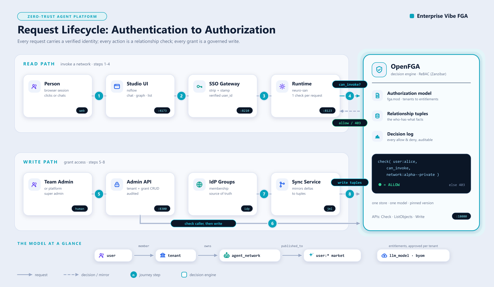
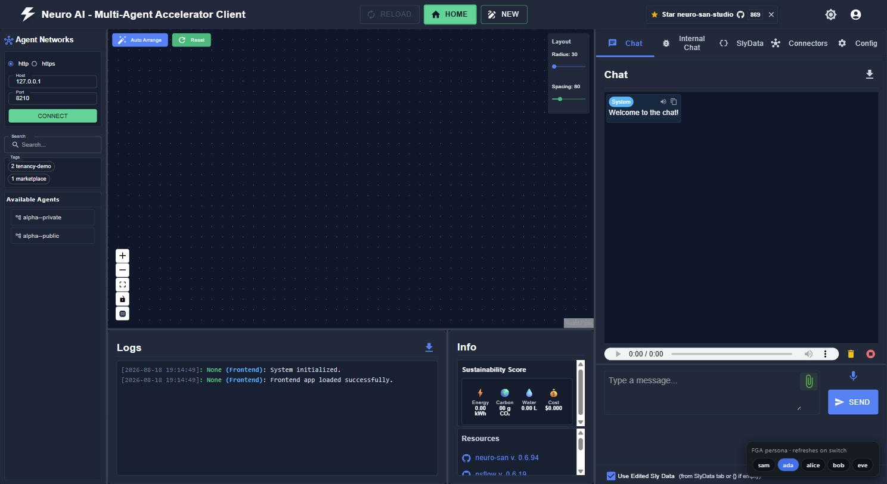
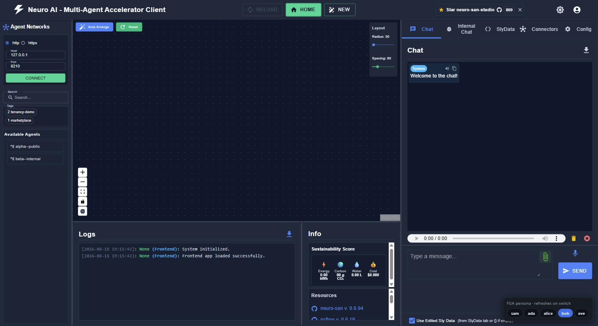
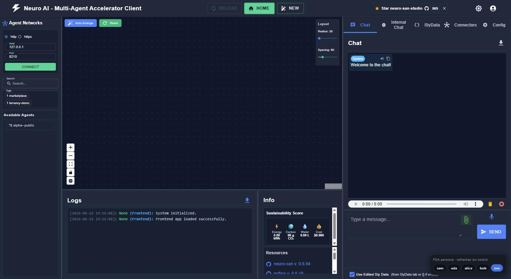

# Enterprise Vibe FGA

Fine-grained, multi-tenant authorization for vibe-to-production agent platforms.

This repo takes the [neuro-san](https://github.com/cognizant-ai-lab/neuro-san) agent runtime
(via a snapshot of [neuro-san-studio](https://github.com/cognizant-ai-lab/neuro-san-studio))
and adds an enterprise authorization layer on [OpenFGA](https://openfga.dev), the
Zanzibar-descended relationship-based access control engine. The result: teams operate as
isolated tenants on one shared cluster, publish agent networks and connectors to a
marketplace with a single tuple write, and LLM usage and bring-your-own-model rights are
governed as super-admin-controlled entitlements.

Everything here is verified end to end: model-layer tests run against the FGA CLI's built-in
engine, and a live E2E suite runs a real OpenFGA server plus a real neuro-san server and
asserts allow/deny per persona over HTTP.

## The objective

Picture an enterprise agent platform: one shared cluster, ~100 teams, 500+ employees.
Teams build agent networks and connectors that must stay **private to their team by
default**, yet any team can **publish** its work to a marketplace for everyone (or share
it with one specific team). A small core team operates the platform as **super admins**.
Every team has its **own admin** who onboards teammates. The platform pays for one
**centralized LLM** everyone uses; later, specific teams get other models **approved
per tenant**, and eventually teams may **bring their own model keys** - both only under
platform control. Access must be explainable to an auditor at any moment: who can touch
what, and why.

This repo is the authorization layer for that platform, built to be **right from the
beginning** rather than retrofitted: model it once in a decision engine, enforce it at
every surface (API, studio UI, admin operations), and prove every claim with a test.

## The architecture



One picture, two journeys, one decision engine:

- **Steps 1-4, the read path.** A person clicks in the studio; the SSO gateway strips any
  self-asserted identity and stamps the verified `user_id`; the runtime asks the decision
  engine exactly one question per request - `can_invoke?` - and enforces the allow / 403
  answer.
- **Steps 5-8, the write path.** A team admin grants through the Admin API, which
  FGA-checks the caller before any write, while IdP group membership is mirrored into
  tuples by the sync service - the hybrid membership model.
- **The core.** OpenFGA holds the authorization model, the relationship tuples, and the
  decision log. The code chip is a real check from the E2E suite resolving to ALLOW.
- **The ribbon.** The whole model in one line: `user -member-> tenant -owns->
  agent_network -published_to-> user:*` (the marketplace), plus per-tenant LLM and BYOM
  entitlements.

The rest of this README follows the picture: how we got here, the model that powers the
core, then the read path, then the write path, then how to run and test all of it
yourself.

## How we got here (the design journey)

The shape of this repo is a sequence of decisions, each forced by something we verified
rather than assumed. Reading them in order explains every component:

1. **Why a relationship engine.** Static permission tables evaluate policy at *write
   time*: group membership and approvals get flattened into rows that go stale as
   people change teams. Requirements like tenants, marketplace sharing, and
   entitlements need *check-time* evaluation of relationships - which is ReBAC, so we
   chose [OpenFGA](https://openfga.dev) (the CNCF engine descended from Google's
   Zanzibar). Deciding factor: the neuro-san runtime already ships an OpenFGA
   authorizer selectable by env var - **no fork**.
2. **Ground the model in what the runtime actually enforces.** Reading the runtime
   source: it checks exactly ONE relation on ONE object type per request
   (`can_invoke` on `agent_network`), object id = the network's hocon filename stem,
   and nothing in it ever writes a tuple. Consequence: the model funnels all
   invocation rights into `can_invoke`, ids follow a `<tenant>--<name>` convention,
   and everything else (create, publish, LLM approval, BYOM) is enforced by platform
   services against the same store. That is the read/write split running through
   this README.
3. **Requirements became model shapes, not code.** Tenant isolation is structural
   (no tuple path = no access, nothing to forget to check). Publishing is ONE tuple:
   `user:*` for platform-wide, `tenant:X#member` for targeted - unpublish is deleting
   it. LLM approval and BYOM are entitlements checked at publish time, because model
   choice is baked into a network's config, not decided per request.
4. **Verify before building on top.** The model-level test suite ran before any server
   existed - and immediately caught a real bug (super admin did not inherit onto LLM
   catalog objects without their `platform` link tuples). Then the live E2E proved the
   runtime enforces what the model says. Then we opened the actual studio UI - and
   found its client sends no identity on the list call and hardcodes chat identity.
   That discovery produced the **identity gateway**: assert identity at the hop the
   runtime trusts, exactly where an SSO layer would assert it in any deployment. The persona
   widget and console exist so anyone can *see* enforcement, not take our word.
5. **The write side, last and deliberately thin.** Onboarding uses a **hybrid**: IdP
   security groups for steady state (the IdP already handles joiner/mover/leaver;
   the sync just mirrors deltas into tuples) and direct tuples for exceptions. The
   admin API checks its callers against the same model it administers, and holds the
   two invariants the model cannot express (born with an admin; last admin
   irremovable). The first super admin is a change-controlled seed - the root of the
   trust chain.

Everything that surprised us along the way is recorded in the gotchas section below,
each with a test pinning it down. Deliberately NOT built here (yet): real SSO/IdP
integration, the marketplace publish workflow, per-tenant key storage, and the
production assurance jobs (shadow checks, reconcile, tripwire) - they are designed in
`authz/README.md` but this repo ships the reference implementation and proof, not the
deployment.

## What the model gives you

| Requirement | How |
|---|---|
| Teams segregated as tenants | `type tenant`; isolation is structural - no tuple path, no access |
| Platform super users | `platform.super_admin` (one IdP group), transitive over everything |
| Every tenant has an admin | `tenant.admin`, required at onboarding |
| Marketplace publish | `published_to: [user:*, tenant#member]` - one tuple publishes platform-wide or to one tenant |
| Common LLM by default | `user:* available_to llm_model:centralized-default` |
| Per-tenant LLM approval | super admin writes `tenant:X#member available_to llm_model:Y` |
| BYOM with own API key | `feature:byom` entitlement; the key itself lives in the secret store |
| Time-boxed access | `time_boxed` CEL condition (used on connector grants) |

Model sources: `authz/model/modules/` (modular OpenFGA files).

## Profiles

One set of model modules, two deployment profiles built from two manifests:

| | **Studio profile** | **Full profile** |
|---|---|---|
| Manifest | `authz/model/core.fga.mod` | `authz/model/full.fga.mod` |
| Modules | core + resources | core + resources + marketplace + connectors + entitlements |
| Role model | Four-role ladder per tenant: super_admin (platform-wide) / admin / developer / analyst | Ladder + member, per-object builder/editor, marketplace sharing |
| Resource types | agent_network (read/update/delete/execute), tool (CRUD), special_agent (access; analyst excluded) | + published_to, connectors, llm_model/feature entitlements |
| Create verb | Tenant-scoped: `can_create_resources` on the tenant ("create WHAT, WHERE") | `can_create_network` on the tenant |
| Role delivery | **Option B default**: IdP groups -> per-request contextual tuples, nothing about users persisted | Persisted membership tuples via the admin API |
| Runtime relation | `AGENT_AUTHORIZER_ALLOW_RELATION=can_execute` | `AGENT_AUTHORIZER_ALLOW_RELATION=can_invoke` |
| Enforcement code | `authz/enforcement/` (middleware -> group mapper -> contextual tuples -> Check/ListObjects) | neuro-san runtime + admin API |

The same relations accept `[user, group#member]`, so a studio deployment can
later switch from contextual to persisted membership - or adopt the optional
modules - with **zero model change**: build from the fuller manifest and start
writing tuples.

**Group naming convention is the role mapping** (studio profile): one IdP group
per team x role - `NSAN-<TEAM>-ADMINS/-DEVELOPERS/-ANALYSTS` plus a global
`NSAN-SUPERADMINS`. Onboarding a team = create its tenant tuple and its three
groups; no code or config changes.

**Front-end persona testing** is gated by `OPENFGA_DEV_IDENTITY=enabled`
(dev builds only): `X-Dev-User`/`X-Dev-Groups` headers substitute the proxy
identity for persona switching; when unset (the default) those headers are
ignored - one env var separates test and production.

## The read path: how enforcement works (steps 1-4)

The neuro-san runtime checks exactly one relation on one type for every HTTP/MCP request:
`can_invoke` on `agent_network:<served-name>` (wired through env vars, no fork). Everything
else - create, publish, LLM approval, BYOM - is checked and written by the platform's own
services against the same store, so one model answers every "who can do what" question.

| Operation | Enforcement point | FGA interaction |
|---|---|---|
| Invoke / chat / connectivity / MCP | neuro-san runtime (built in) | Check `can_invoke` |
| List networks (concierge, marketplace) | neuro-san runtime (built in) | ListObjects `can_invoke` |
| Create network in a tenant | publish service | Check `can_create_network`, write `tenant` + `builder` |
| Publish / unpublish | publish service | Check `can_publish`, write/delete `published_to` |
| Approve an LLM for a tenant | admin API | Check `can_approve`, write `available_to` |
| Register a BYOM key | key-registration API | Check `can_use` on `feature:byom` |

Runtime wiring (see `authz/run_e2e.ps1` for the working set):

```
AGENT_AUTHORIZER=neuro_san.internals.authorization.openfga.open_fga_authorizer.OpenFgaAuthorizer
AGENT_AUTHORIZER_ACTOR_KEY=user
AGENT_AUTHORIZER_RESOURCE_KEY=agent_network
AGENT_AUTHORIZER_ALLOW_RELATION=can_invoke
AGENT_AUTHORIZER_ACTOR_ID_METADATA_KEY=user_id
FGA_API_URL=...   FGA_STORE_NAME=...   FGA_MODEL_ID=<pinned>   FGA_POLICY_FILE=authz/model/model.json
```

## The write path: onboarding and membership (steps 5-8)

Enforcement answers "may X do Y" - the admin API (`authz/admin_api.py`, port 8300) is the
governed way tuples come into being. It follows a **hybrid membership model**:

- **Steady state - IdP groups.** Team membership lives in your IdP's security groups
  (Entra ID, Okta, ...). A tenant admin manages their own group in the IdP; the sync
  service turns group deltas into `group` membership tuples. Joiner, mover, and leaver
  come free: the IdP disables the account, the tuple follows, access dies. The
  `/idp/...` endpoints simulate this sync path so the flow is testable standalone.
- **Exceptions - direct tuples.** Contractors, one-off grants, break-glass: written
  directly against the tenant, visible individually in every access review.

Every management operation is itself authorized by OpenFGA before it writes - the
authorization system authorizes its own administration:

| Operation | Endpoint | Caller must pass |
|---|---|---|
| Create tenant (born with an admin group) | `POST /tenants` | `super_admin` on the platform |
| Add / remove member (exception path) | `POST/DELETE /tenants/{t}/members` | `can_administer` on the tenant |
| Promote / demote admin | `POST/DELETE /tenants/{t}/admins` | `can_administer` on the tenant |
| Group membership (steady-state path) | `POST/DELETE /idp/groups/{g}/members` | admin of a tenant the group is bound to, or super admin |
| Access review (recertification sweep) | `GET /tenants/{t}/access-review` | `can_administer` on the tenant |

Two invariants the model cannot express live in this service: a tenant is **created with
an admin group**, and the **last admin can never be removed** (409). Every write appends
to a JSONL audit trail (actor, operation, target, outcome) - the stand-in for a
production transactional outbox. The only tuple the API cannot bootstrap is the first
super admin: that is the change-controlled pipeline seed, the root of the trust chain.

Try it against the running stack:

```powershell
# ada (tenant alpha admin) onboards a member via the group path
irm -Method Post "http://127.0.0.1:8300/idp/groups/alpha-team/members" `
    -Headers @{user_id="ada"} -ContentType "application/json" -Body '{"user":"frank"}'
# frank can now invoke alpha--private on the runtime; remove him and he is 403 again

# sam (super admin) creates a tenant; eve gets a clean 403 trying the same
irm -Method Post "http://127.0.0.1:8300/tenants" -Headers @{user_id="sam"} `
    -ContentType "application/json" -Body '{"slug":"gamma","admin_group":"g-gamma-admins"}'
```

The E2E suite (`tests/e2e_authz/test_admin_api_e2e.py`, 12 tests) proves the loop across
services: an admin API grant flips the runtime from 403 to 200 immediately, a group
removal revokes it immediately, and the last-admin invariant holds.

## Quick start (Windows)

```powershell
# 1. toolchain (one time)
py -3.12 -m venv .venv
.venv\Scripts\python.exe -m pip install -r authz\requirements-authz.txt
# download openfga.exe and fga.exe into tools\ (see authz\README.md)

# 2. the whole thing: model tests -> OpenFGA -> seed -> neuro-san -> E2E pytest
powershell -ExecutionPolicy Bypass -File authz\run_e2e.ps1
```

Expected output: `Tests 4/4 passing`, then `47 passed`, then `ALL GREEN`.

### Test it yourself from a front end

```powershell
powershell -ExecutionPolicy Bypass -File authz\run_e2e.ps1 -KeepUp   # stack stays running
.venv\Scripts\python.exe authz\demo_ui.py                            # persona console
# open http://127.0.0.1:8200
```

The persona console lets you switch between sam / ada / alice / bob / eve / anonymous and
watch the concierge list and per-network 200/403 change live. Its tiny proxy injects the
`user_id` header the way an SSO layer would in a real deployment - the browser
never talks to the runtime directly with a self-asserted identity.

### See enforcement in the real studio (nsflow)

```powershell
.venv\Scripts\python.exe -m pip install nsflow==0.6.19                # one time
.venv\Scripts\python.exe authz\studio_gateway.py                      # identity gateway on :8210
$env:NEURO_SAN_SERVER_HOST="127.0.0.1"; $env:NEURO_SAN_SERVER_HTTP_PORT="8210"
.venv\Scripts\python.exe -m nsflow.run --client-only                  # studio on :4173
```

Then put the persona switcher INSIDE the studio (one-time, idempotent; re-run after any
nsflow reinstall; `--remove` to undo):

```powershell
.venv\Scripts\python.exe authz\install_studio_widget.py
```

Open the studio at http://127.0.0.1:4173. A floating "FGA persona" pill bar sits in the
bottom-right corner: click sam / ada / alice / bob / eve and the studio reloads as that
persona - the Available Agents sidebar changes (alice sees `alpha--private` +
`alpha--public`, bob sees `beta--internal` + `alpha--public`, sam sees everything), and
chat and connectivity are authorized the same way. The standalone switcher page also
remains at http://127.0.0.1:8210/__persona.

Why the gateway is required: nsflow 0.6.19 sends no `user_id` on its concierge call and
hardcodes chat identity to the backend's `USER` env var, so identity must be asserted at
the hop the runtime trusts - the same place an SSO layer would assert it in any deployment
(`browser -> nsflow -> gateway -> neuro-san -> OpenFGA`).

## The personas, visualized

Same studio, same server, same model - the only thing that changes between these five
screenshots is the identity on the wire. The persona pill bar (bottom-right) switches it;
the Available Agents sidebar is the enforcement result.

### sam - platform super admin

Sees all three networks. `super_admin` on `platform:vibe` inherits through every tenant.


### ada - tenant alpha admin

Sees `alpha--private` and `alpha--public`. Admin of tenant alpha via her IdP group
binding; no path to tenant beta's objects.



### alice - alpha member and builder

Same visibility as ada (member of tenant alpha), but fewer rights on them: she can edit
what she built, and cannot publish or administer.


### bob - beta member

The mirror image: `beta--internal` plus `alpha--public`. He sees alpha's published network
because of the single marketplace tuple `user:* published_to agent_network:alpha--public`,
and nothing else of alpha's.



### eve - authenticated stranger, zero grants

Only the marketplace-published network survives. Everything else is invisible AND returns
403 if probed directly.



## What this change adds (file tree)

Everything below is introduced by this repo; every file not shown is the unmodified
upstream neuro-san-studio snapshot.

```
enterprise-vibe-fga/
|-- README.md                     NEW  this file (upstream README moved to docs/)
|-- .gitignore                    MOD  ignores tools/, .e2e-logs/, generated model.json
|-- authz/                        NEW  the authorization layer
|   |-- model/
|   |   |-- core.fga.mod               STUDIO profile manifest (core + resources)
|   |   |-- full.fga.mod               FULL profile manifest (all modules)
|   |   `-- modules/                   core / resources / marketplace / connectors / entitlements
|   |-- enforcement/                   studio-profile library: middleware, group mapper,
|   |                                  contextual tuples (Option B), client, provisioner
|   |-- tests/
|   |   |-- tenancy.fga.yaml           full-profile suite (grants AND denials)
|   |   |-- studio-persisted.fga.yaml  4-role ladder matrix, persisted mode
|   |   `-- studio-contextual.fga.yaml same matrix, Option B contextual mode
|   |-- seed/
|   |   `-- tuples.yaml                demo personas and grants
|   |-- run_e2e.ps1                    one-command end-to-end run
|   |-- requirements-authz.txt         minimal python deps
|   |-- admin_api.py                   onboarding/membership API, FGA-checked (:8300)
|   |-- demo_ui.py                     persona console (standalone front end, :8200)
|   |-- studio_gateway.py              identity gateway nsflow -> neuro-san (:8210)
|   |-- install_studio_widget.py       injects the in-studio persona pill bar
|   `-- README.md                      layer docs: test layers, runbook, tuple writers
|-- registries/vibe/              NEW  demo tenant networks
|   |-- manifest.hocon
|   |-- alpha--private.hocon           tenant alpha only
|   |-- alpha--public.hocon            published platform-wide
|   `-- beta--internal.hocon           tenant beta only
|-- tests/e2e_authz/              NEW
|   |-- test_tenancy_e2e.py            18 live HTTP assertions vs the running stack
|   `-- test_admin_api_e2e.py          12 onboarding tests incl. grant->200 / revoke->403
`-- docs/
    |-- UPSTREAM-README.md        MOVED  original neuro-san-studio README
    `-- images/persona-*.jpg      NEW   the five screenshots above
```

## Hard-won gotchas (each one is asserted by a test)

1. **Pin `FGA_MODEL_ID`.** Without it the runtime writes a new model on every store bootstrap.
2. **The `agent_network` object id must equal the hocon filename stem.** Use
   `<tenant-slug>--<network-slug>` names (see `registries/vibe/`).
3. **Conditions do not evaluate on runtime checks.** The stock authorizer sends no query
   context, so keep conditioned tuples off `can_invoke`; they are safe on relations checked
   by platform services that pass `current_time`.
4. **Grant `user:system`** for networks the periodic event watcher must reach.
5. **A missing `user_id` header authorizes as the literal string `"None"`** - it can still
   invoke `user:*`-published networks. Authentication in front of the runtime is mandatory;
   whatever SSO layer you deploy must strip and re-set the header from the verified token.
6. **Authorization runs before existence**: probing an unknown network returns 403, not 404.
7. **Catalog objects need their platform link tuple** (`platform:vibe platform llm_model:X`)
   or super-admin inheritance silently fails. Found by the model test suite.

## Repo layout

```
authz/model/          fga.mod + core / agents / connectors / entitlements modules
authz/tests/          tenancy.fga.yaml - model tests (fga model test, runs in CI, no server)
authz/seed/           tuples.yaml - demo personas and grants
authz/run_e2e.ps1     one-command end-to-end run
registries/vibe/      three demo tenant networks (alpha--private, alpha--public, beta--internal)
tests/e2e_authz/      pytest suite against the live stack (18 assertions)
docs/UPSTREAM-README.md   the original neuro-san-studio README
```

Demo personas: `sam` (platform super admin), `ada` (tenant alpha admin), `alice` (alpha
member, builder), `bob` (beta member), `eve` (authenticated stranger with zero grants).

## Provenance and license

Built on a snapshot of neuro-san-studio (Apache License 2.0, see `LICENSE.txt`); the studio's
own examples, tools, and docs are retained unmodified. The authorization layer, tenancy
model, demo registries, and E2E harness are this repo's addition.
